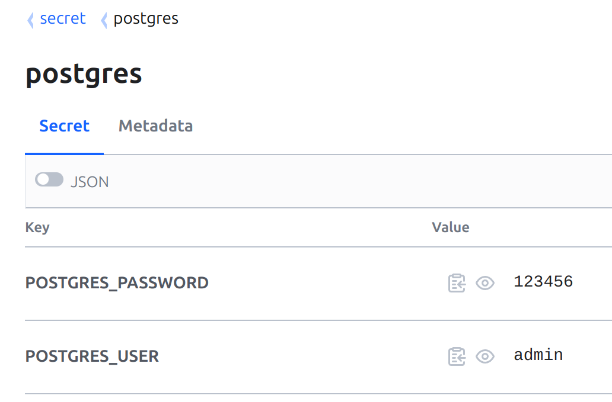

# Kubernetes секреты из Vault используя external-secrets-operator

## Введение
В этой статье будет описано как создать kubernetes секреты из Vault с помощью AppRole используя 
external-secrets-operator.

## Kubernetes кластер
Для начала создадим Kubernetes кластер (например, в Яндекс облаке с помощью Terragrunt).

Создание kubernetes кластера кратко описана в файле [create-k8s-by-terraform-in-yc.md]
(terragrunt-k8s/create-k8s-by-terraform-in-yc.md)

# Установка hashicorp vault. Если у вас hashicorp vault, то пропускаем раздел.
```shell
helm install vault oci://registry-1.docker.io/bitnamicharts/vault --version 0.2.1 -n vault --create-namespace
```

- Инициализация и распечатывание хранилища. Ждем когда vault-server-0 перейдет в состояние Running.
```shell
$ kubectl get pods --namespace "vault" -l app.kubernetes.io/instance=vault
NAME                              READY   STATUS    RESTARTS   AGE
vault-injector-6f8fb5dcff-bbl2s   0/1     Running   0          14s
vault-server-0                    0/1     Pending   0          7s
```

- Инициализируйте один сервер хранилища с количеством общих ключей по умолчанию и пороговым значением ключа по умолчанию:
```shell
$ kubectl exec -ti vault-server-0 -n vault -- vault operator init
Unseal Key 1: A1zYR6DZ3n29AKHr5bOJLj8fFkWpGKiKm8FTeYCtLk6z
Unseal Key 2: qEl/ng1ErOXUQx7XoA1vGOnFn8K+70pQpEXTuopsAKEP
Unseal Key 3: 7CSLzJmloLs7bWC9EeCMUazy/dOfPF6lJRgJsK06LSxP
Unseal Key 4: F9GJcqYM7APaIPk+ZdrVz9enDtfm85cnm1tf+PvJTHu8
Unseal Key 5: nSkLvgDy/2L/6QlNxDL9Kc/aCYnCSPY3hu4dEj2o7n+9

Initial Root Token: hvs.t0chVgBFR0lRle6pHNnO7VhM
```

- В выходных данных отображаются общие ключи и сгенерированный исходный корневой ключ. Распечатайте сервер hashicorp vault с общими ключами до тех пор, пока не будет достигнуто пороговое значение ключа:
```shell
$ kubectl exec -ti vault-server-0 -n vault -- vault operator unseal # ... Unseal Key 1
$ kubectl exec -ti vault-server-0 -n vault -- vault operator unseal # ... Unseal Key 2
$ kubectl exec -ti vault-server-0 -n vault -- vault operator unseal # ... Unseal Key 3
```

- В ОТДЕЛЬНОМ терминале пробросьте порт 8200 от hashicorp vault
```shell 
kubectl port-forward vault-server-0 8200:8200 -n vault
```

- Экспортируйте адрес hashicorp vault
```shell
export VAULT_ADDR=http://127.0.0.1:8200
```

Вы можете либо настроить AppRole в Vault из CLI либо через terraform код.

Настроим AppRole Vault через terraform.
Переходим в директорию с файлом `setting-approle-vault.tf`
```shell
cd vault-resource
```

Экспортируем ваш токен (в данном случае root токен)
```shell
export VAULT_TOKEN=hvs.t0chVgBFR0lRle6pHNnO7VhM
```

Применим конфигурацию terraform.
```shell
terraform init
terraform apply
```

- Создайте секрет из CLI.
```shell
vault kv put secret/postgres POSTGRES_USER=admin POSTGRES_PASSWORD=123456
```

Либо создайте Vault секрет через UI как показано на скриншоте:


Выведим на экран терминала role-id и secret-id и запоминаем их значение.
B выходим из директории vault-resource.
```shell
terraform output role_id
terraform output secret_id
cd ..
```

Если вам интересно настроить AppRole в Vault из CLI, то настройка описано в отдельном файле 
[create-approle-vault-cli.md](vault-resource/create-approle-vault-cli.md)


Добавляем helm репо External Secrets Operator
```shell
helm repo add external-secrets https://charts.external-secrets.io
```

Устанавливаем External Secrets Operator
```shell
helm install external-secrets \
external-secrets/external-secrets \
    --wait \
    -n external-secrets \
    --create-namespace \
    --version 0.8.3 \
    --set installCRDs=true
```

Настройка external-secrets.
 - Указываем `role_id` в файле `external-secrets/secret-store.yaml` в поле `roleId`.
 - Указываем `secret_id` в файле `external-secrets/vault-secret.yaml` в поле `secret-id`.
Файлы конфигурации в директории external-secrets подробно документированы.


Применяем yaml из директории external-secrets
```shell
kubectl apply -f external-secrets/vault-secret.yaml
kubectl apply -f external-secrets/secret-store.yaml
kubectl apply -f external-secrets/external-secret.yaml
```

Дебаг:
ClusterSecretStore c названием vault-backend должен иметь CAPABILITIES - ReadWrite.
```shell
$ kubectl get ClusterSecretStore vault-backend
NAME            AGE     STATUS   CAPABILITIES   READY
vault-backend   3m19s   Valid    ReadWrite      True
```

Если ExternalSecret имеет статус SecretSyncedError, то смотрим describe.
```shell
$ kubectl get ExternalSecret -n external-secrets external-secret
NAMESPACE          NAME              STORE           REFRESH INTERVAL   STATUS              READY
external-secrets   external-secret   vault-backend   5s                 SecretSyncedError   False
```

Смотрим describe ExternalSecret.
```shell
kubectl describe ExternalSecret -n external-secrets external-secret
```
Если видим ошибку `permission denied`, значит неправильно настроли пути.
```shell
Code: 403. Errors:

* 1 error occurred:
  * permission denied
```

Тестирование AppRole используя Vault cli.
Входим в vault используя `role_id` и `secret_id`
```shell
$ vault write auth/approle/login role_id="" secret_id=""
Key                     Value
---                     -----
token                   hvs.CAESILZuXjEGHKTTUD7WjNKDXijGSDLrWTWvE6xzB6O2BXrxGh4KHGh2cy5tZEZhNFVIODdhUktjRDViQVFaUmswc20
token_accessor          tNDR6kn0R3rM1idryFOkSBmi
token_duration          768h
token_renewable         true
token_policies          ["default" "read-policy"]
identity_policies       []
policies                ["default" "read-policy"]
token_meta_role_name    data
```

Получаем список секретов
```shell
vault kv list secret
```

Прочитаем секрет
```shell
vault kv get secret/postgres
```

Если получаем ошибку, то меняем политику на такую и проверяем правильность путей (path)
```shell
resource "vault_policy" "secret-read-policy" {
  name = "read-policy"

  policy = <<EOT
path "*" {
  capabilities = ["read", "list"]
}
EOT
}
```

# Links:
 - https://github.com/fvoges/terraform-vault-basic-workflow
 - https://github.com/tiwarisanjay/external-secrets-operator
 - https://github.com/tiwarisanjay/argocd-everything/blob/main/argocd-ha-vault-sso/README.md
 - https://artifacthub.io/packages/helm/bitnami/vault
 - https://gengwg.medium.com/setting-up-flux-v2-with-kind-cluster-and-github-on-your-laptop-56e28b0a8120
 - https://github.com/hashicorp/terraform-provider-vault/blob/main/website/docs/r/mount.html.md
 - https://earthly.dev/blog/eso-with-hashicorp-vault/
